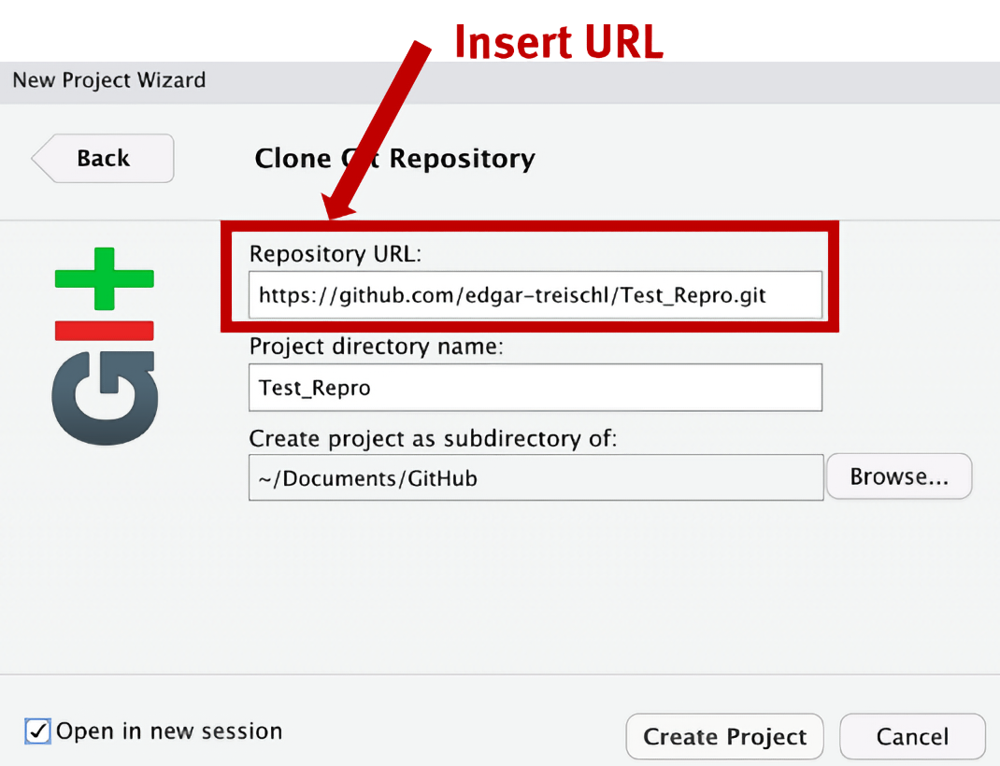
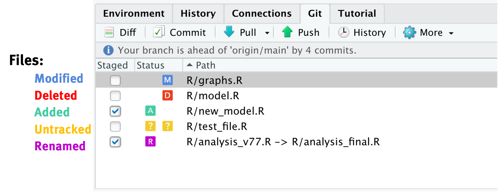

background-size: cover
class: left, middle


```{r setup, include=FALSE}
options(htmltools.dir.version = FALSE)

library(ggplot2)
library(tidyverse)
library(readr)
library(gridExtra)
library(cowplot)

#library(jtools)
library(icons)
icon_style(fontawesome("rocket", style = "solid"), scale = 2, fill = "red")

knitr::opts_chunk$set(fig.retina = 3, warning = FALSE, message = FALSE)


theme_set(theme_minimal(base_size = 20)) # sets a default ggplot theme

has_bash <- Sys.which('bash') != '' && .Platform$OS.type != 'windows'

library(RefManageR)
bib <- ReadBib("PracticeR_FINAL.bib", check = FALSE)
ui <- "- "
```

```{r meta, echo=FALSE}
library(metathis)
meta() %>%
  meta_general(
    description = "Git(Hub): A Gentle Introduction for R Users",
    generator = "xaringan and remark.js"
  ) %>% 
  meta_name("github-repo" = "edgar-treischl/Workshop_GitHubIntro") %>% 
  meta_social(
    title = "Git(Hub): A Gentle Introduction for R Users",
    url = "https://edgar-treischl.github.io/Workshop_GitHubIntro/",
    og_type = "website",
    og_author = "Edgar J. Treischl",
    image = "https://edgar-treischl.github.io/Workshop_GitHubIntro/images/preview.png",
    image_alt = "Preview Slide"
  )


```


```{r best-features, echo=FALSE}
#searc
#xaringanExtra::use_search(show_icon = TRUE, position = "top-right")

xaringanExtra::use_progress_bar(color = "#023047", location = "top")

xaringanExtra::use_tile_view()

# xaringanExtra::style_search(match_background = "black",
#                             input_background = "white",
#                             input_border = "black",
#                             match_current_background = "green")


xaringanExtra::use_panelset()
xaringanExtra::use_clipboard()
```


```{r xaringan-themer, include=FALSE, warning=FALSE}
library(xaringanthemer)
style_mono_accent(
  base_color = "black",
  header_font_google = google_font("Commissioner"),
  text_font_google   = google_font("EB Garamond"),
  code_font_google   = google_font("Fira Code")
)

# style_mono_accent(
#   base_color = "black",
#   header_font_google = google_font("Lato"),
#   text_font_google   = google_font("Montserrat", "300", "300i"),
#   code_font_google   = google_font("Fira Code")
# )


colors = c(
  red = "#f34213",
  purple = "#3e2f5b",
  orange = "#ff8811",
  green = "#136f63",
  white = "#FFFFFF"
)
```


```{r, results='asis', echo=FALSE}
cat(readLines("github-corner.html"), sep = "\n")
```

<br/>

# .black[Automated Reports]
## .black[A Gentle Introduction]


<h3><a href="http://www.edgar-treischl.de" target="_blank" style="color:#C51717;">Dr. Edgar J. Treischl</a></h3>

<br/>
<br/>
.white[Last update: `r Sys.Date()`]
<br/>
<br/>
<h4 style = "color:black; text-align: right;">Press `r emoji::emoji("o")` or `r emoji::emoji("arrow_right")`</h4>


<div class="remark-footer"><a href="https://unsplash.com/de/@synkevych" target="_blank" style="color: gray;">Images: Roman Synkevych</a></div>


---
## Agenda


.pull-left[

### `r emoji::emoji("one")` Einführung MetaMaster
### `r emoji::emoji("two")` Einführung ReportMaster
### `r emoji::emoji("three")` Next steps
### `r emoji::emoji("four")` Gist


```{r}
# # A tibble: 8 × 6
#   report        vars  plot  label_short                                            
#   <chr>         <chr> <chr> <chr>                                                  
# 1 gm_p2         W343D W34d  GS_Im Ganztag kann ich Dinge tun, die mir Spaß machen. 
# 2 gs_p2         W343D W34c  Im Ganztag kann ich Dinge tun, die mir Spaß machen.     
# 3 rpt_sus_gm_p2 W343D W34d  GS_Im Ganztag kann ich Dinge tun, die mir Spaß machen. 
# 4 rpt_sus_gs_p2 W343D W34b  Im Ganztag kann ich Dinge tun, die mir Spaß machen.    
# 5 rpt_sus_fz_p2 W343D W34b  Im Ganztag kann ich Dinge tun, die mir Spaß machen.     
# 6 rpt_all_fz_p2 W343D W34c  Im Ganztag kann ich Dinge tun, die mir Spaß machen.    
# 7 gm_p4         W343D W34d  GS_Im Ganztag kann ich Dinge tun, die mir Spaß machen. 
# 8 gs_p4         W343D W34c  Im Ganztag kann ich Dinge tun, die mir Spaß machen.     
```


]

.pull-right[


<a href="https://edgar-treischl.github.io/PracticeR/" target="_blank"></a>

This workshop is based on Practice R.
]


---


## Einführung Metamaster

.pull-left[

###  MetaMaster 

- Automatisiert die Generierung der Metadaten: Reduziert Fehleranfälligkeit

- Durch Reprodzierbarkeit können Bugs iterativ ausgemärzt werden

- Zieht sich die Rohdaten aus Lime Survey via API
- Bereitet die Metadaten für die Generierung von Reports auf

#### Fehleranfälligkeit manuell generierter Daten: B112 vs. B112e


]

.pull-right[
<figure>
    
</figure>
]


---
background-image: url("images/logo.png")
background-position: 90% 5%
background-size: 8%

## Einführung Metamaster

#### Beispielauszug Master 01 

```{r, eval=FALSE}
# Get questions for a specific master template
LS_GetMasterQuestions(id = "197865", 
                      name = "master_01_bfr_allg_gm_elt_00_2022_v4")

# # A tibble: 29 × 7
#    surveyID template  code  variable text  question_type filter
#    <chr>    <chr>     <chr> <chr>    <chr> <chr>         <chr> 
#  1 197865   master_0… E01   B131W12… An d… F             FALSE 
#  2 197865   master_0… E01   B132a    Mein… F             FALSE 
#  3 197865   master_0… E01   B132c    Die … F             FALSE 
#  4 197865   master_0… E01   B133b    Die … F             FALSE 
#  5 197865   master_0… E02   B334W12… An d… F             FALSE 
# # 19 more rows
# # Use `print(n = ...)` to see more rows
```


---
background-image: url("images/logo.png")
background-position: 90% 5%
background-size: 8%

## Kochrezept: Generierung der Meta Daten


### 01: Ist `config.yml` (API Zugang, etc.) vorhanden?

```yaml
default:
  tmp.server: "semiotikon"
  api_url: "URL"
  tmp.user: "user"
  tmp.credential: "Password"
```


### 02. Laden des Pakets und setzen der Config

```{r}
#Set the R_CONFIG_ACTIVE
library(MetaMaster)
Sys.setenv(R_CONFIG_ACTIVE = "default")
```


---
background-image: url("images/logo.png")
background-position: 90% 5%
background-size: 8%

## Einführung Metamaster

### 03. Build process starten


.pull-left[

1. Download der Daten aus LimeSurvey
2. Export der Rohdaten als Excel Sheet
3. Aufbereitung der Rohdaten als Metadaten (Tabellen Templates, Reports)
4. Eventuell: Upload der Metadaten in eine DB/Daten Checks per Mail
5. Export der Metadaten als Excel Sheet

]

.pull-right[

```{r, eval=FALSE}
build(send_report = TRUE, 
      update = TRUE)

# Starting the build process...
# Fetching raw meta data from Lime Survey
# Raw meta data exported.                          
# Building metadata for the master data...
# MetaMaster exported.                  
# The table 'metadata_raw' has been successfully uploaded to the database.
# Sending the report...
# The email message was sent successfully.                       
# By the power of Grayskull: Building process completed.
```


]

---

## Einführung ReportMaster

.pull-left[


#### Der ReportMaster wurde entwickelt, um automatisch dynamische Berichte für Lime Survey zu erstellen. 

- ReportMaster prüft, ob eine Umfrage abgelaufen ist.

- Danach ruft das Package Daten über die Lime Survey API ab und kombiniert sie mit Metadaten, um einen dynamischen Bericht zu erstellen.


]

.pull-right[
<figure>
    
</figure>
]


---
background-image: url("images/logo_rm.png")
background-position: 90% 5%
background-size: 8%


## Einführung ReportMaster


.pull-left[

- ReportMaster läuft als Cron Job via: `run_CronJob()`. Diese Funtion ruft alle Schritte auf, die zur automatischen Erstellung eines PDF-Berichts notwendig sind. 

1. Sie prüft auf geschlossene Umfragen mit gültigen Antworten vorliegen.

2. Die Daten werden aus Lime Survey herunter geladen und mit den Metadaten gemacht. 

3. Generiert Grafiken und fügt sie in den Bericht ein.

]

.pull-right[

```{r, eval=FALSE}
run_CronJob()
# Lucky fellow, there are new expired surveys!
# Joining with `by = join_by(sid)`
# Joining with `by = join_by(sid)`
# Get parameters for: Adalbert-Raps-Schule Staatliche BOS Kulmbach
# Downloaded data from LimeSurvey.
# All parameters set.   
# Create data and plots [3.3s]
# Get report infos [881ms]
# Create plots [2.1s]
# Create tables [4.4s]
# Exported PDF file for school '0850' and group 'elt'
```

]


---
background-image: url("images/logo_rm.png")
background-position: 90% 5%
background-size: 8%

## Einführung ReportMaster

### Report können natürlich auch manuell erstellt werden

```{r, eval=FALSE}
# Folgende Parameter müssen gesetzt werden
library(ReportMaster)
Sys.setenv(R_CONFIG_ACTIVE = "production")

run_Parallel(
  snr = "2370",
  audience = "leh",
  stype = "gm",
  ubb = "TRUE",
  ganztag = "FALSE",
  results = "Lehrkräfte"
)

```


---
## Von manuellen zu automatisierten Metadaten

#### Meta Daten beinhaltet nur Informationen die es in Lime Survey überhaupt gibt 

- Reifenfolge der Auswertung wird über den **Plot** (diese beinhalten ein oder mehere Surveyitems) definiert

- Ergänzende Auswertungen (**Extraplots**): Auswertung erfolgt über Plots wobei die Survey Items nicht mehrfach in Daten gelistet sind

- Vereinheitlichung der Survey Strukturdaten (**Master to Templates**)

- Gewährleistung der Konsistenz von **Variablenbezeichnung** (Gesamtdatensatzes)

#### => In diesen Fällen muss noch nachgeschärft werden


---

## Plot (Variablenbezeichnung)

### Für die Automatisierung muss die Plotbezeichung bei allen Survey Items nach festgelegten Muster hinzugefügt werden: Von *B112* zu *B112XB11*

### Einheitliche Variablenbezeichnung bestehend aus: 
 - Code (fortlaufen Seitennummer)
 - Variablenbezeichnung
 - Plot

```{r}
# Split im Datensatz:
item <- "E01XB112XB11"
stringr::str_split(item, "X")
```

---

## Plot (Variablenbezeichnung)

.pull-left[

### Bislang wurden diese Extraplot ohne Markerierung den manuellen Daten hintzefügt

### Aufbereitung der Extraplots nach folgenden System


]

.pull-right[

```{r, eval=FALSE}
extraplots_raw
# extraplots_raw
# # A tibble: 866 × 4
#    report        vars     plot  extraplot
#    <chr>         <chr>    <chr> <lgl>    
#  1 unique_report A131W121 A13   FALSE    
#  2 unique_report A131W121 W12   TRUE     
#  3 unique_report A131W121 A13   FALSE    
#  4 unique_report A131W121 W12   TRUE     
#  5 unique_report A131W121 A13   FALSE    
# # ℹ 856 more rows
# # ℹ Use `print(n = ...)` to see more rows
```


]

#### => Extraplots werden aus den Rohdaten extrahiert (A131W121); den Reports Tabelle hinzugefügt und der Plotbezeichnung ausgetauscht (von A13 zu W12)


---

## Master to Templates

#### Bislang keine Automatisierung der MtT Daten: Manuelle Zuordnungen

```{r}
# # A tibble: 104 × 4
#    surveyls_title                       template                rpt   rpt_overall
#    <chr>                                <chr>                   <chr> <chr>      
#  1 master_01_bfr_allg_gm_elt_00_2022_v4 tmpl_bfr_allg_gm_elt_0… rpt_… gm_p1      
#  2 master_01_bfr_allg_gm_elt_00_2022_v4 tmpl_bfr_allg_gm_elt_0… rpt_… gm_p3      
#  3 master_03_bfr_allg_gm_leh_00_2022_v4 tmpl_bfr_allg_gm_leh_0… rpt_… gm_p1      
#  4 master_03_bfr_allg_gm_leh_00_2022_v4 tmpl_bfr_allg_gm_leh_0… rpt_… gm_p3      
#  5 master_03_bfr_allg_gm_leh_00_2022_v4 tmpl_bfr_allg_gm_leh_0… rpt_… gm_p2      
# # ℹ 94 more rows
# # ℹ Use `print(n = ...)` to see more rows
```

#### Plus: Manuelle Logik beim Aufbau der Strukturdaten: 1 Master sind X Templates und Y Reports zugeordnet


---

## Master to Templates

#### Prinzipiell kein Matching notwendig, wenn den Master_01 die Templates_01 und Reports01 zugeordnet sind

```{r}
# # A tibble: 104 × 4
#    surveyls_title                       template                rpt   rpt_overall
#    <chr>                                <chr>                   <chr> <chr>      
#  1 master_01_bfr_allg_gm_elt_00_2022_v4 tmpl_bfr_allg_gm_elt_0… rpt_… gm_p1      
#  2 master_01_bfr_allg_gm_elt_00_2022_v4 tmpl_bfr_allg_gm_elt_0… rpt_… gm_p3      
#  3 master_03_bfr_allg_gm_leh_00_2022_v4 tmpl_bfr_allg_gm_leh_0… rpt_… gm_p1      
#  4 master_03_bfr_allg_gm_leh_00_2022_v4 tmpl_bfr_allg_gm_leh_0… rpt_… gm_p3      
#  5 master_03_bfr_allg_gm_leh_00_2022_v4 tmpl_bfr_allg_gm_leh_0… rpt_… gm_p2      
# # ℹ 94 more rows
# # ℹ Use `print(n = ...)` to see more rows
```

---

## Konsistente Variablenbezeichnung

### Sonst: Äpfel-und-Birnen-Problem beim Aufbau des Gesamtdatensatze


```{r, eval=FALSE, echo=FALSE}
metadata_raw |> 
  dplyr::filter(ubb) |>
  dplyr::select(vars, text) |> 
  dplyr::arrange(vars) |> 
  dplyr::distinct()
```


```{r, eval = FALSE}
# # A tibble: 161 × 2
#    vars      text                                                                          
#    <chr>     <chr>                                                                         
#  1 A112aXA1a "Die LK achtet konsequent auf die Einhaltung von Regeln."                     
#  2 A112aXA1a "Die LK achtet auf die Einhaltung von Regeln."                                
#  3 A112bXA1a "Die SuS beachten die vereinbarten Regeln."                                   
#  4 A113XA1a  "Die LK geht mit Blick auf die Gruppe und den Einzelnen angemessen mit Störun…
#  5 A113XA1a  "Die LK geht angemessen mit Störungen um."                                    
#  6 A114XA1a  "Die SuS reagieren auf Signale oder Hinweise der LK."                         
#  7 A114XA1a  "Die SuS beachten die vereinbarten Regeln."                                   
#  8 A11XA1    "Der Unterricht wird durch Störungen nicht beeinträchtigt."                   
#  9 A11XA1    "<p style=\"font-size:26px;\"><b>Der Unterricht wird durch Störungen nicht be…
# 10 A11XA1    "<p style=\"font-size:26px;\"><b>Der Unterricht wird durch Störungen nicht be…
# # ℹ 151 more rows
# # ℹ Use `print(n = ...)` to see more rows
```


---

## Kleinere Baustellen

### Bereinigung der Mastertemplates (z.B. HTML)


---
## Mehrere Probleme

### Generell: Fehleranfälligkeit manuell erstellter Daten

### Zuordnung zu Plot (und weitere Informationen) nicht in Lime Survey enthalten

### Hinzufügen zusätzlicher Auswertungen via Extraplots:
 - Variable B112 ist Plot B12 zugeordnet
 - Variable B112 ist Plot W13 zugeordnet
 => Extraplots können per Definition nicht automatisiert generiert werden

---
background-image: url("images/ibm.gif")
background-size: cover
class: bottom, center

# .white[`r emoji::emoji("one")` Git/GitHub ... What?] 


---
## Von manuellen zu automatisierten Metadaten


```{r, error=TRUE, warning=TRUE, echo=FALSE}
library(dplyr)

# Create two example data frames
df1 <- tibble(
  album_id = c(1, 2, 3),  # Numeric IDs
  album_name = c("Abbey Road", "Revolver", "Sgt. Pepper's Lonely Hearts Club Band")
)

df1

df2 <- tibble(
  album_id = c("1", "2", "3"),  # Character IDs
  song_name = c("Come Together", "Eleanor Rigby", "Lucy in the Sky with Diamonds")
)

df2

# Attempt to join the data frames by album_id
df1 |> left_join(df2, by = "album_id")
```


---

## (01) Git/GitHub ... What?

.left-column[
<br/>
<a href="https://git-scm.com/" target="_blank"></a>
<br/>
<br/>
<br/>
<a href="https://github.com" target="_blank"></a>

]

.right-column[
- Git is a version control system to track changes over time
- Continuous integration (CI) and continuous deployment (CD)
- GitHub (GitLab) is an host (website) for Git-based projects
- Each project is stored in a repository (folder with all files)
- A repository can be *public* or *private*


### Why Hosts like GitHub?

- Easier to track code changes
- Share work
- Automated workflows
- Websites for projects
- Work together
- ...

]


---
## (01) Git/GitHub ... What?


.panelset[
.panel[.panel-name[Track Code]


]

.panel[.panel-name[Share Code]

.pull-left[
```{r plot-last, fig.show = 'hide', eval=FALSE}
# Source the script
link <- paste0("https://raw.githubusercontent.com/",
               "edgar-treischl/edgar/refs/heads/",
               "master/inst/graphs/long_wide.R")

devtools::source_url(link)
showplot()
```

```{r eval=FALSE}
# Run a shiny app from GitHub
shiny::runGitHub("power-app", 
                 "edgar-treischl", 
                 ref="main")
```

]
.pull-right[

]


]

.panel[.panel-name[Automate workflows]

- Deploy a website, book, presentation
- Run tests
- Create a package

.pull-left[

```yaml
on:
  push:
    branches: [main, master]
    
jobs:
  pkgdown:
    runs-on: ubuntu-latest
    steps:
    - uses: my_script.R
```


]

.pull-right[

]
]

]


---
background-image: url("images/g3.gif")
background-size: cover
class: bottom, center

# .white[`r emoji::emoji("two")` Getting Started] 


---
## (02) Getting Started

### Push and pull `r emoji::emoji("flex")` on a regular basis:

1. Install Git:
  - Install on your local machine
  - Introduce *yourself*
  - Learn some *Git*

2. Connect to GitHub
  - Create a *Personal Access Token* (PAT)
  - Create a *Repository*

3. Connect GitHub and R Studio
  - *Clone* the newly created repository
  - *Setup R Studio* and connect to GitHub
  - Get in touch with the R Studio *Git pane*


---
## (02) Install Git on your local machine

.left-column[
<br/>
<a href="https://git-scm.com/" target="_blank"></a>
<br/>
<br/>
<br/>
<a href="https://github.com" target="_blank"></a>

]

.right-column[

- Windows: https://git-scm.com/download/win
- OS X: https://git-scm.com/download/mac
- Debian/Ubuntu: sudo apt-get install git-core


```{bash eval = has_bash}
# I am git code to check if git is installed

# Go to the console and type:
git --version
```


- Next, create a free GitHub account

]


---
background-image: url(https://usethis.r-lib.org/logo.png)
background-position: 90% 5%
background-size: 10%

## (02) Install Git: Introduce yourself


### Via the shell

```bash
#In the console
git config --global user.name "User Name"
git config --global user.email "email@adress.com"

```

### Or with the `r emoji::emoji("rocket")` usethis package

```{r, eval=FALSE}
library(usethis)
use_git_config(user.name = "Jane Doe",
               user.email = "jane@example.org")
```


---
## (02) Install Git: Introduce yourself

### Check global configuration settings

```{bash eval = has_bash}
git config --global --list
```


---
background-image: url("images/cat.gif")
background-size: cover
class: bottom, center

# .white[Git can be scary, but ...] 


---
## (02) Install Git: New Vocabulary `r emoji::emoji("sword")`


.pull-left[

Wait, Git is scary because it's full of technical jargon<sup>1</sup>:

- **Repository**: A folder with all project files
- **Push**: Send code (files) to Git 
- **Pull**: Get code (files) from a Git repository
- **Commit**: A snapshot of a repository at a certain point in time
- **Branch**: A parallel version within the repository to test new features

...

.footnote[
[1] As often, R Studio helps us to work with Git.
]

]

.pull-right[
<figure>
    
    <figcaption style = "color: darkgray;">'Artwork by @allison_horst'</figcaption>
</figure>
]


---
## (02) Install Git: New Vocabulary `r emoji::emoji("sword")` 


.pull-left[

- **Merge**: Combine two branches
- **Merge conflicts**: When two branches have changed the same part of a file, Git will not be able to automatically determine what is correct
- **Forks**: Forks are interconnected repositories, for example, to examine a repository from someone else
- **Pull requests**: A way to suggest changes to a repository


]


.pull-right[
<figure>
    
    <figcaption style = "color: darkgray;">'Artwork by @allison_horst'</figcaption>
</figure>
]


---
## (02) Connect to GitHub: Create a PAT

### Create a PAT in R Studio:

```{r, eval=FALSE}
# The create_github_token() function will open a browser window to create a token
usethis::create_github_token()

#The set_github_pat() function will store the token in the .Renviron file
credentials::set_github_pat("token")

```


### Or manually via: 

On the GitHub website, go to: 
  - Settings > Developer settings > Personal access tokens: 
  - https://github.com/settings/tokens


---
## (02) Connect to GitHub


### Check if R Studio is connected to GitHub:

```{r}
# Actually, whoami will show you who you are on GitHub ...
gh::gh_whoami()
```

#### `r emoji::emoji("celebration")` ... you're connected!

---
## (02) Connect to GitHub: Create a repository


---
## (02) Connect to GitHub: Create a repository


---
## (02) Connect GitHub and R Studio

.pull-left[

#### 1. Create a new project in R Studio and click next.

#### 2. Pick Version Control and cick next.

#### 3. Pick Git and click next.

#### 4. Paste the repository URL: `r emoji::emoji("right")`

]


.pull-right[

]


---
## (02) Connect GitHub and R Studio: Git Pane

### Once R Studio is connected, search for the Git pane:



---
## (02) Connect GitHub and R Studio: Git Pane

### You gonna stage, commit, push, and let it all out  `r emoji::emoji("dancing")`


---
background-image: url("images/practice.gif")
background-size: cover
class: bottom, center

# .white[Practice Makes Perfect] 


---
## Practice Makes Perfect

### `r emoji::emoji("plus")` Create a new repository on GitHub  
### `r emoji::emoji("pc")` Clone the repository on your local machine
### `r emoji::emoji("file")` Add a new repository file
### `r emoji::emoji("button")` Commit the changes
### `r emoji::emoji("mail")` Push the changes to the remote repository


---
background-image: url("images/merge.gif")
background-size: cover
class: bottom, center

# .white[`r emoji::emoji("three")` Basics of Git] 


---
## (03) Git basics

```bash
# Initialize a new repository
git init <your repository name>

# Clone a repository
git clone <git-repo-url>

# Create a new branch
git branch <branch-name>

# List all branches
git branch --list

# Delete a branch
git branch -d <branch-name>

# Switch to a branch
git checkout <branch-name>
```


---
## (03) Git for the daily workflow

.pull-left[

```bash
# Add a file to the staging area
git add <file-name-1>

# Add all files to the staging area
git add -A

# Commit changes
git commit -am <commit-message>

# Push changes to the remote rep
git push <remote> <branch-name>

# Pull changes from the remote rep
git pull

# Merge two branches
git merge <branch-name>
```


]

.pull-right[
<br/>
<br/>
<figure>
    
    <figcaption style = "color: darkgray;">'Artwork by @allison_horst'</figcaption>
</figure>
]


---
## (03) Even more Git? `r emoji::emoji("explode")`

.pull-left[

#### Do I need all the code if I am happy with the Git Pane?

- The Pane simplifies common Git operations, but Git Code gives you more control, flexibility, and the ability to handle complex operations

- **Common example**: Merge conflicts can occur when two branches have changed the same part of a file and Git will not be able to automatically determine what is correct

- Git commands give you a more detailed understanding of where the conflicts are happening. This is particularly useful when the conflict isn't straightforward to resolve.

- Of course, we don't have to remember in detail `r emoji::emoji("wink")`

]

.pull-right[

#### Merge Conflict:

```bash
# <<<<<<< HEAD
# print("This is my feature branch.")
# =======
# print("This is my master branch.")
# >>>>>>> master

```
#### Typical workflow to solve the merge conflict:

- Manually resolve the conflict in the file(s) and run:

```bash
git add script.R
git commit -m "Resolved merge conflict"
```


]


---
## (03) Git for troubleshooting `r emoji::emoji("skull")`

.pull-left[

```bash
# Show who changed what and when
git blame file.txt

# Shows the working tree status
git status

# Shows changes between commits
git diff

#💀💀💀 DANGER
# Revert some existing commits
git revert SHA

# Reset the repository to a previous commit 
# Take care: This will discard any local changes
git reset 

#Ultima ratio ;-)
# A "hard reset": forcefully discard any local changes
```

]
.pull-right[
<br/>
<br/>
<figure>
    <a href="https://git-scm.com/book/de/v2" target="_blank"></a>
    <figcaption style = "color: darkgray;">'Pro Git by Chacon and Straub'</figcaption>
</figure>


]


---
## (03) Commit history in R Studio


---
background-image: url("images/bite.gif")
background-size: cover
class: bottom, center

# .black[`r emoji::emoji("four")` Gist]


---
## (04) Gist

.panelset[


.panel[.panel-name[Package]

.pull-left[

GitHub Gist is a service provided by GitHub that allows you to share and store snippets of code, text, or any other kind of file.

- Quick sharing of code (with your future self)
- Code embedding
- No need for a full repository


]


.pull-right[

<div class="info-box">
  <i>`r emoji::emoji("parrot")`️️</i> The gist package provides a set of functions to work with GitHub Gist. It allows you to copy, create, and delete gists via the GitHub API. Moreover, it comes with an R Studio addin to get access and manage your Gists.
</div>

<a href="https://edgar-treischl.github.io/gist/" target="_blank"></a>

]


]

.panel[.panel-name[R Studio Addin]

.pull-left[


#### R Studio Addin: 

```{r, eval=FALSE}
#You can install the development version via:
devtools::install_github("edgar-treischl/gist")
```

```{r, eval=FALSE}
#The gistAddin()
gist::gistAddin()
```


]

.pull-right[

]

]

.panel[.panel-name[Via the console]

.pull-left[

```{r, eval=FALSE}
library(gist)
#Create a gist
gist_create(name = "A_Test.R", 
            code = '#Test
print("Hello world")', 
            description = "Test Gist")
```

```{r, eval=FALSE}
#gistfiles lists all files and returns names and ids
gist_get(filename = "A_Test.R")

#> ✔ Copied A_Test.R from your GitHub account.
```


]

.pull-right[
<a href="https://gist.github.com/edgar-treischl" target="_blank"></a>

]
]

]


---
class: right, middle


## Thank you for your attention!


[`r icons::fontawesome("rocket")` www.edgar-treischl.de](https://www.edgar-treischl.de)

[`r icons::fontawesome("github")` edgar-treischl](https://github.com/edgar-treischl)

[`r icons::fontawesome("envelope")` edgar.treischl@isb.bayern.de](mailto:edgar.treischl@isb.bayern.de)


---
class: right, middle


## Licence

This presentation is licensed under a CC-BY-NC 4.0 license.
You may copy, distribute, and use the slides in your own work, as long as you give attribution to the original author on each slide that you use. Commercial use of the contents of these slides is not allowed.
<br/>
<br/>


---

## References


```{r, print_refs, results='asis', echo=FALSE, warning=FALSE, message=FALSE}

print(bib[key = "chacon_pro_2014"], 
  .opts = list(check.entries = FALSE, 
               style = "html", 
               bib.style = "authoryear"))


print(bib[key = "treischl_practice_2023"], 
  .opts = list(check.entries = FALSE, 
               style = "html", 
               bib.style = "authoryear"))

print(bib[key = "usethis"], 
  .opts = list(check.entries = FALSE, 
               style = "html", 
               bib.style = "authoryear"))

print(bib[key = "devtools"], 
  .opts = list(check.entries = FALSE, 
               style = "html", 
               bib.style = "authoryear"))

```


